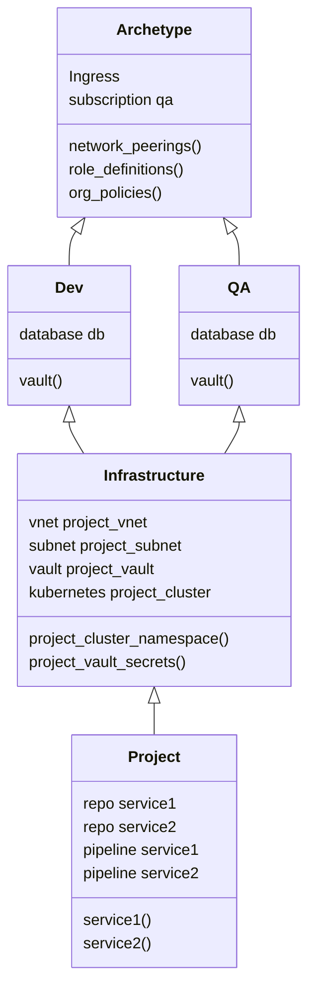
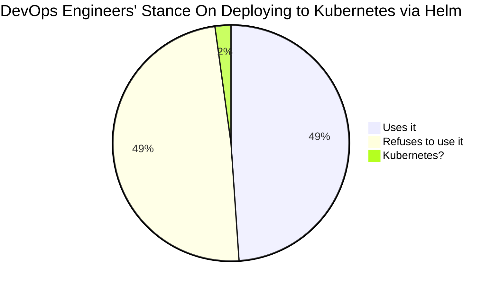

```mermaid
classDiagram
  Archetype <|-- Dev
  Archetype <|-- QA
  Archetype : Ingress
  Archetype : subscription qa
  Archetype : network_peerings()
  Archetype : role_definitions()
  Archetype : org_policies()
  Dev <|-- Infrastructure
  Dev : database db
  Dev : vault()
  QA <|-- Infrastructure
  QA : database db
  QA : vault()
  Infrastructure <|-- Project
  Infrastructure : vnet project_vnet
  Infrastructure : subnet project_subnet
  Infrastructure : vault project_vault
  Infrastructure : kubernetes project_cluster
  Infrastructure : project_cluster_namespace()
  Infrastructure : project_vault_secrets()

  class Project{
    repo service1
    repo service2
    pipeline service1
    pipeline service2
    service1()
    service2()
  }
```

```mermaid
pie
    title DevOps Engineers' Stance On Deploying to Kubernetes via Helm
    "Uses it" : 45
    "Refuses to use it" : 45
    "Kubernetes?" : 2
```

