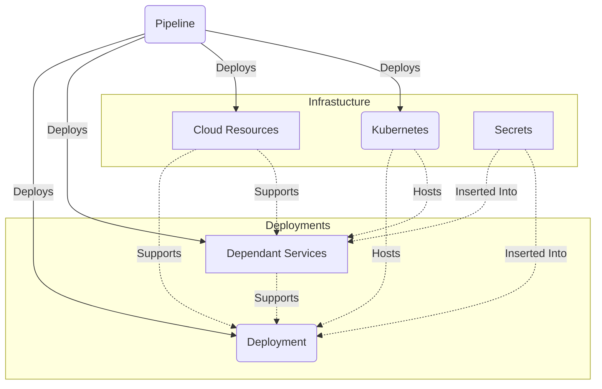
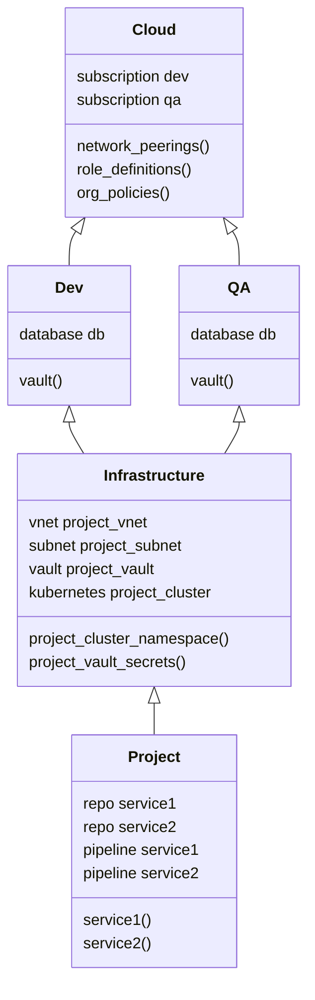
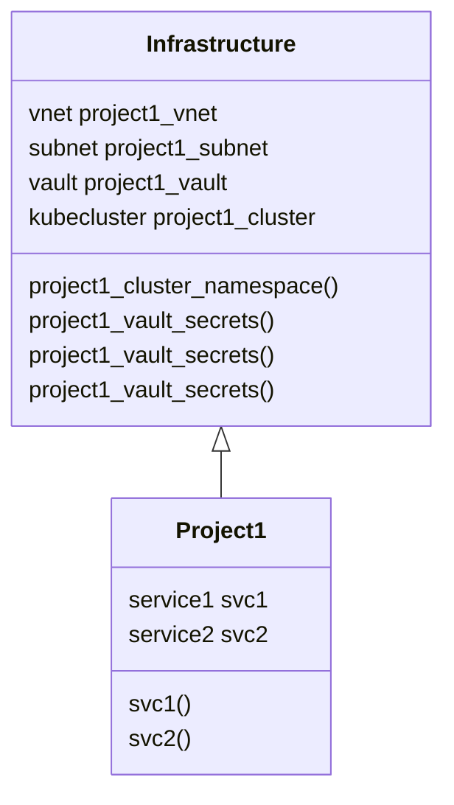

```mermaid
graph TD
  subgraph Infrastucture
    Cluster(Kubernetes)
    CloudResources[Cloud Resources]
    Secrets[Secrets]
  end
  subgraph Deployments
    Deployment(Deployment)
    DependantServices[Dependant Services]
  end

  Pipeline(Pipeline) -->|Deploys| Cluster
  Pipeline -->|Deploys| CloudResources
  Pipeline -->|Deploys| DependantServices
  Pipeline -->|Deploys| Deployment
  Cluster -.->|Hosts| DependantServices
  Cluster -.->|Hosts| Deployment
  Secrets -.->|Inserted Into| Deployment
  Secrets -.->|Inserted Into| DependantServices
  CloudResources -.->|Supports| DependantServices
  CloudResources -.->|Supports| Deployment
  DependantServices -.->|Supports| Deployment
```

```mermaid
classDiagram
  Cloud <|-- Dev
  Cloud <|-- QA
  Cloud : subscription dev
  Cloud : subscription qa
  Cloud : network_peerings()
  Cloud : role_definitions()
  Cloud : org_policies()
  Dev <|-- Infrastructure
  Dev : database db
  Dev : vault()
  QA <|-- Infrastructure
  QA : database db
  QA : vault()
  Infrastructure <|-- Project
  Infrastructure : vnet project_vnet
  Infrastructure : subnet project_subnet
  Infrastructure : vault project_vault
  Infrastructure : kubernetes project_cluster
  Infrastructure : project_cluster_namespace()
  Infrastructure : project_vault_secrets()

  class Project{
    repo service1
    repo service2
    pipeline service1
    pipeline service2
    service1()
    service2()
  }

```

```mermaid
classDiagram
  Infrastructure <|-- Project1
  Infrastructure : vnet project1_vnet
  Infrastructure : subnet project1_subnet
  Infrastructure : vault project1_vault
  Infrastructure : kubecluster project1_cluster
  Infrastructure : project1_cluster_namespace()
  Infrastructure : project1_vault_secrets()
  Infrastructure : project1_vault_secrets()
  Infrastructure : project1_vault_secrets()

	class Project1{
	service1 svc1
    service2 svc2
    svc1()
    svc2()
	}

```